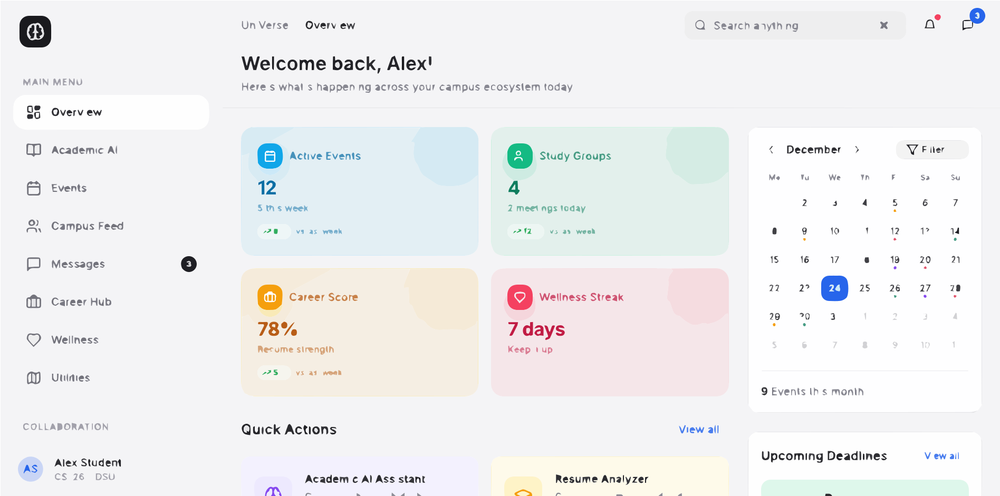

# UniVerse Connect 🎓
### Bridging the Gap Between Campus Life and Career Excellence

**UniVerse Connect** is more than just a platform; it's a student-first ecosystem powered by AI, designed to unify the scattered pieces of university life. From academic breakthroughs to career-defining moments, we provide the tools to help every student thrive in a modern university environment.



---

## ✨ Why UniVerse?
In an era of digital disconnection, UniVerse acts as a central hub where academic rigor meets community warmth. We've built this with a human-centric approach, ensuring that technology serves as a bridge, not a barrier, for students, faculty, and alumni.

## 🚀 Core Features

### 🌐 Smart Social Ecosystem
*   **Dual-Feed Dynamics:** Seamlessly toggle between your local **Campus Feed** (internal updates and student life) and the global **Universe Feed** (inter-university networking and trends).
*   **Anonymous Exchange:** Engage in course-specific discussion boards where questions are asked without fear, reducing social pressure and fostering true learning.
*   **Rich Media Interaction:** Share your journey through high-quality media posts, interactive polls, and real-time reactions.

### 🧠 Academic Intelligence (AI)
*   **24/7 Academic RAG:** A specialized Retrieval-Augmented Generation assistant, powered by GPT-4o and Gemini, providing context-aware answers to complex academic doubts.
*   **Crowdsourced Knowledge:** Access a massive repository of notes, assignments, and question banks, organized by course and peer-reviewed by the community.
*   **Collaborative Research Hub:** A dedicated space for faculty-student synergy, making research project management intuitive and transparent.

### 💼 Career Accelerator
*   **AI Resume Architect:** Upload your resume for an instant, deep-dive analysis. Get a score out of 100, ATS-compatibility checks, and actionable feedback to stand out to recruiters.
*   **Mentorship Matchmaking:** Our pgvector-powered semantic search matches you with the ideal mentors and alumni based on your skills, interests, and aspirations.
*   **Market Pulse:** Stay ahead with real-time industry insights and emerging skill requirements in your field.

### 🏟️ Campus Synergy & Wellness
*   **Event Lifecycle Management:** From hackathons to wellness seminars—discover, RSVP, and manage events with ease.
*   **Cab-Pooling & Travel:** Coordinate smart travel with fellow students, optimizing resources and ensuring safety for university commuting.
*   **AI Mood Logger:** Track your daily wellness trends with a human touch. Our AI provides non-diagnostic insights to help you manage deadline stress and maintain balance.

---

## 🛠️ The Tech Behind the Tech
We believe in using the most robust, modern tools to ensure a smooth, premium experience.

*   **Frontend:** [Next.js 16](https://nextjs.org/) (App Router) for high-performance server-rendered experiences.
*   **Styling:** [Tailwind CSS](https://tailwindcss.com/) & [Framer Motion](https://www.framer.com/motion/) for fluid, beautiful animations.
*   **Database:** PostgreSQL with [pgvector](https://github.com/pgvector/pgvector) on [Supabase](https://supabase.com/) for semantic search and real-time updates.
*   **ORM:** [Prisma](https://www.prisma.io/) for type-safe data management.
*   **AI Orchestration:** OpenAI GPT-4o & Google Gemini API for intelligent reasoning and analysis.
*   **Infrastructure:** Serverless deployment on [Vercel](https://vercel.com/) with [BullMQ](https://optimalbits.github.io/bull/) for heavy background tasks.

---

## 📦 Getting Started

### 1. Clone & Install
```bash
git clone https://github.com/vishalcoc44/UniVerse.git
cd UniVerse
npm install
```

### 2. Environment Setup
Create a `.env` file in the root and add your Supabase and AI API keys (refer to `.env.example`).

### 3. Launch the Universe
```bash
npm run dev
```
Navigate to `http://localhost:3000` and start exploring!

---

## 🤝 Community & Support
UniVerse is built by students, for students. We welcome contributions that make campus life better for everyone.

*   **Feedback:** Have a feature idea? Let us know in the forums!
*   **Contribute:** Check out our contribution guidelines to get started.
*   **License:** Distributed under the MIT License.

*UniVerse Connect — Where your campus meets the world.*
